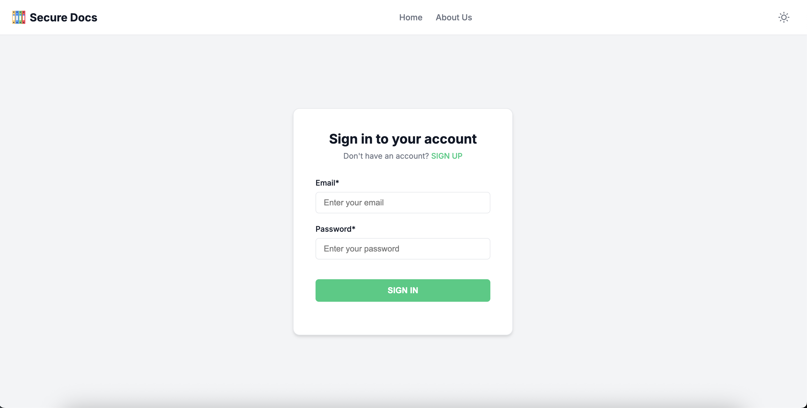
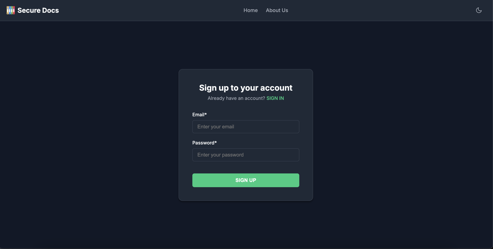
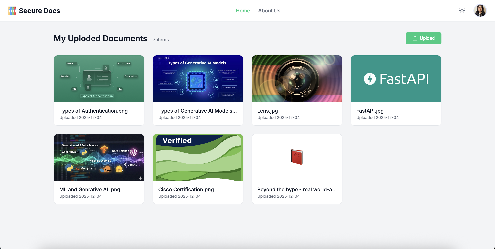
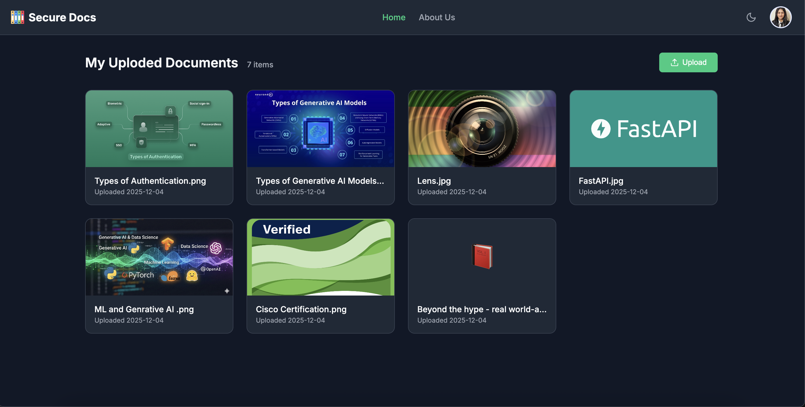
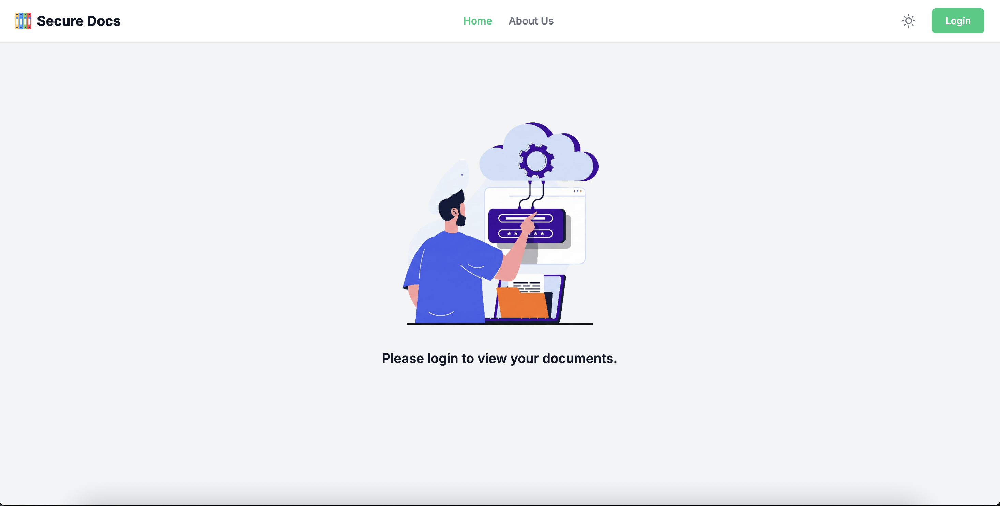
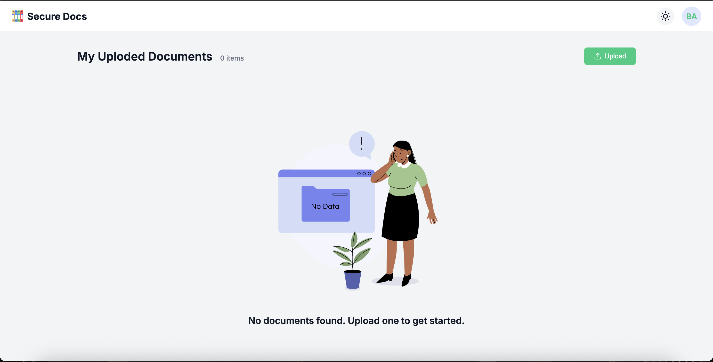
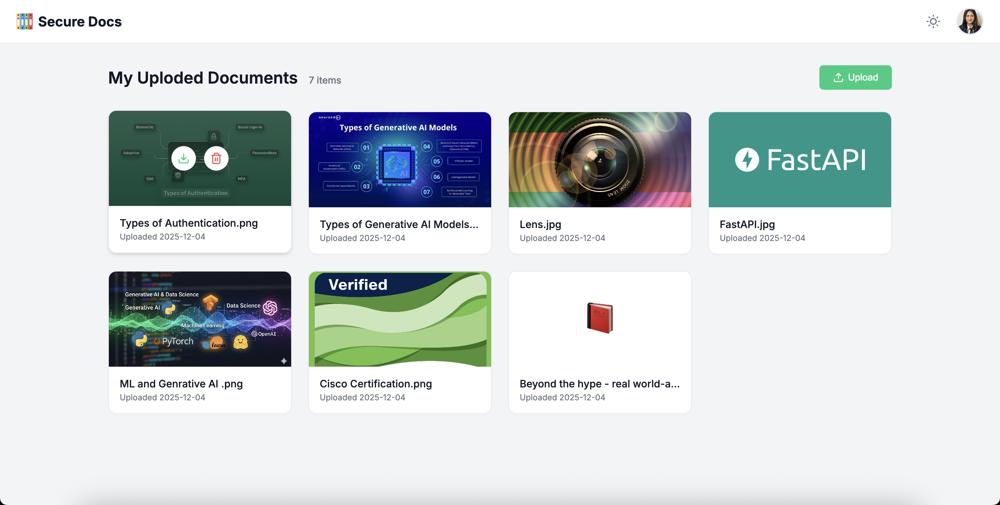
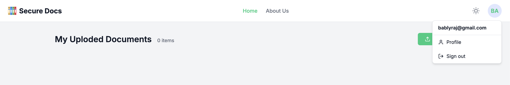
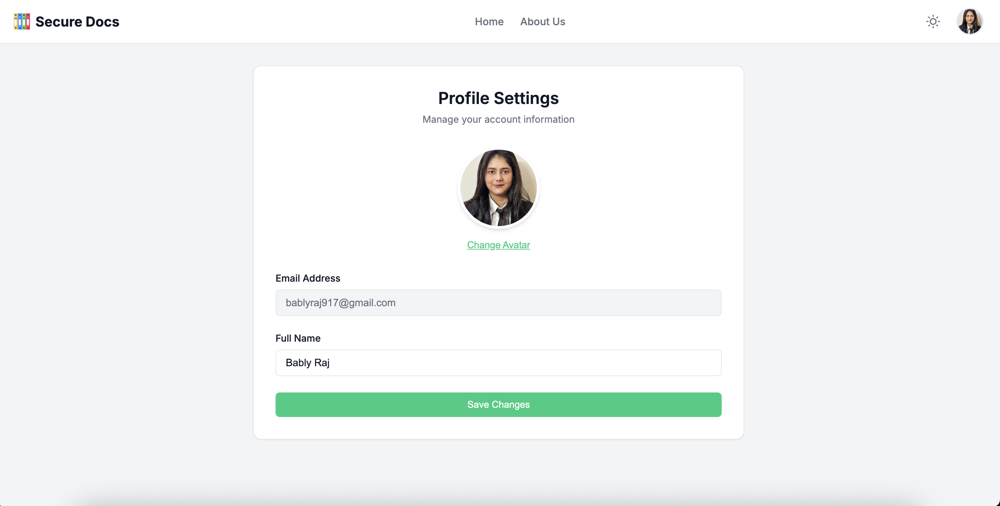
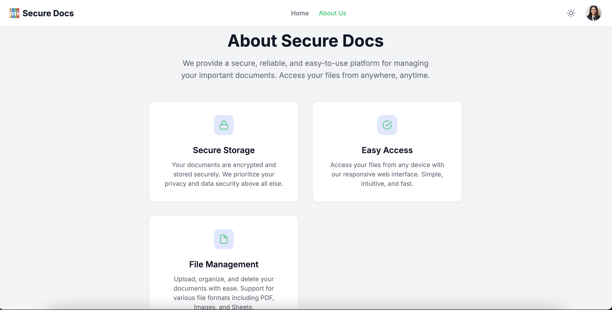

# Secure Docs

A secure and modern document management system built with Python (FastAPI & Flask).

## Features

- **User Authentication**: Secure signup and login functionality with JWT authentication.
- **Document Management**: Upload, view, download, and delete documents.
- **Profile Management**: Update user profile information and avatar.
- **Modern UI**: Responsive design with a clean interface.
- **Dark Mode**: Built-in dark mode support for better accessibility and user preference.

## Tech Stack

- **Backend**: FastAPI (Python)
- **Frontend**: Flask (Python) serving HTML/CSS/JS templates
- **Database**: SQLite
- **Styling**: Custom CSS with CSS Variables for theming

## Screenshots

### Authentication
| Login | Signup |
|:---:|:---:|
|  |  |

### Dashboard
| Light Mode | Dark Mode |
|:---:|:---:|
|  |  |

### User Experience
| Before Login | After Login |
|:---:|:---:|
|  |  |

| Document Interaction | Navigation Menu |
|:---:|:---:|
|  |  |

| Profile | About Us |
|:---:|:---:|
|  |  |

## Setup & Running

1. **Install Dependencies**:
   ```bash
   pip install -r requirements.txt
   ```

2. **Start the Backend**:
   ```bash
   python backend.py
   ```
   The backend API will run at `http://127.0.0.1:8000`.

3. **Start the Frontend**:
   ```bash
   python frontend.py
   ```
   The frontend application will run at `http://127.0.0.1:5000`.

4. **Access the App**:
   Open your browser and navigate to `http://127.0.0.1:5000`.
